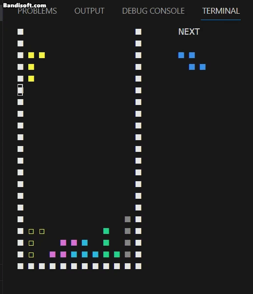
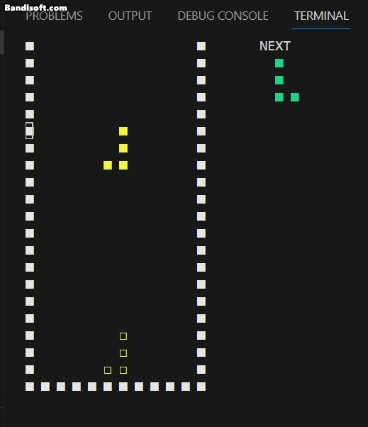
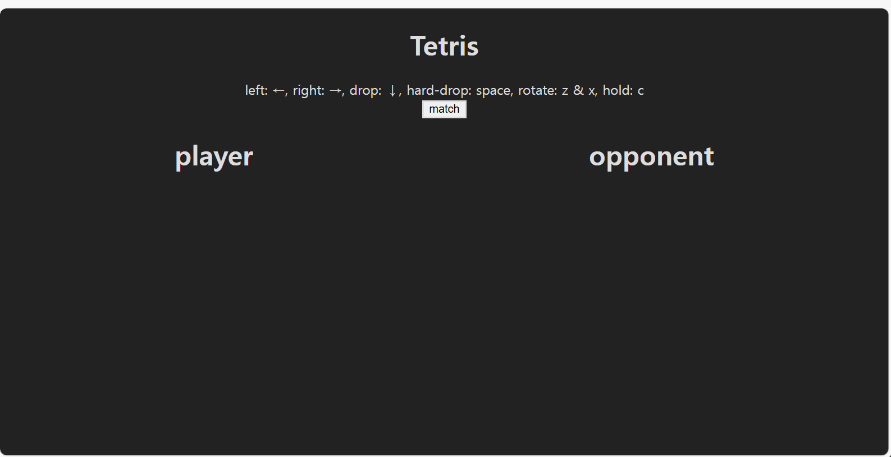
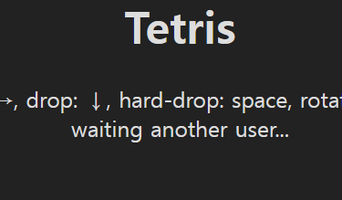
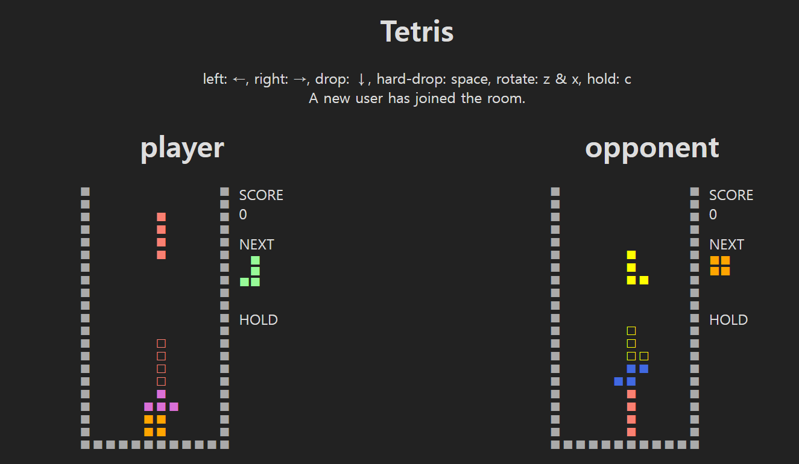

# tetris

## Table of Contents
1. [Introduction](#Introduction)
2. [Features](#features)
3. [Description of local tetris](#description-of-local-tetris)
    1. [폴더 구조](#폴더-구조)
    2. [코드 구조](#코드-구조)
    3. [block.py](#blockpy)
    4. [board.py](#boardpy)
    5. [main.py](#mainpy)
    6. [pockey](#pocket)
    7. [async](#async)
4. [Description of online tetris](#description-of-online-tetris)
    1. [웹 폴더 구조](#웹-폴더-구조)
    2. [main.py](#mainpy-1)
    3. [webgame.py](#webgamepy)
    4. [index.html](#indexhtml)
5. [Future Improvements](#future-improvements)
6. [Conclusion](#conclusion)


## Introduction
제가 제작한 게임은 1:1 파이썬 테트리스 게임입니다. \
프로젝트 주제를 테트리스로 선정한 이유는 다음과 같습니다.

1. 이론보다는 프로그램의 구현에 집중할 수 있다.

    이번 학기 수업의 목표는, 앞으로 있을 기계학습 등 프로그래밍과 연관성이 높은 과목을 따라가기 위해 python의 기초를 이해하고 익숙해지는 것입니다. 이러한 목표를 감안한다면, 머신러닝 등 수학과 관련된 주제들은 그 깊이는 깊지만, 이론을 이해하는 것에 너무 많은 시간을 투자해야 해서 python을 연습하는 취지로는 적당하지 않을 것이라고 생각했습니다. 따라서 진입장벽이 높지 않고 python의 다양한 기능을 응용해볼 수 있는 테트리스 게임을 프로젝트 분야로 선택했습니다.

2. 테트리스는 규칙이 단순하고 직관적이다.

    너무 생소한 게임을 고르면 주객이 전도되어 게임 룰을 숙지하고 작동방식을 이해하는 데 너무 많은 시간을 할애하게 될 수도 있습니다. 테트리스는 세계적으로 유명한 게임이고, 작동 방식이 간단하기 때문에 이러한 노력을 최소화 할 수 있습니다.

## Features

### 테트리스에 대한 설명

테트리스는 특정한 모양의 블럭을 균일하게 쌓아서 점수를 획득하는 게임입니다.

규칙은 다음과 같습니다.

1. 블럭(Tetrimino)의 종류는 7가지: I블럭 / J블럭 / L블럭 / O블럭 / S블럭 / Z블럭 / T블럭

2. 보드의 크기는 세로 20칸, 가로 10칸

3. 무작위 종류의 블럭이 하나 생성 된 후 바닥에 닿기까지 일정한 속도로 한 칸 씩 떨어집니다.

4. 떨어지는 도중의 블럭은 왼쪽, 오른쪽, 아래 방향으로 움직일 수 있으며
시계 또는 반시계 방향으로 회전할 수 있습니다.

5. 블럭이 바닥에 닿으면 이동하거나 회전할 수 없고, 새로운 블럭이 생성됩니다.

6. 만약 공백 없이 가로로 한 열을 블럭으로 모두 채우면, 그 열은 지워집니다. 해당 열 위에 블럭이 쌓여있다면 아래로 한칸 내려옵니다. 동시에 여러 열이 블럭으로 채워진다면, 그 열들은 동시에 지워집니다.

자세한 규칙은 후술하겠습니다.

### 프로젝트의 특징

1. 게임은 유지보수를 위해 로컬과 온라인 두 버전으로 만들었습니다.

2. 로컬 버전은 명령 프롬프트 창에서 실행되며, python으로 구현하였습니다. 온라인 버전은 javascript, python으로 구현하였고 웹 주소에 접속하면 실행됩니다. 웹 서버는 google cloud platform에서 작동하고 있습니다.

3. 최근 테트리스 게임들의 세부적인 규칙들은 복잡한 부분이 많아서 기본적인 기능 위주로 구현했습니다.


## Description of local tetris

### 폴더 구조

폴더의 구조는 다음과 같습니다.

- game/
    - \_\_main\_\_.py
    - block.py
    - board.py
    - cursor.py

- web/
    - \_\_main\_\_.py
    - index.html
    - webgame.py

game 폴더는 테트리스 관련 데이터가 저장된 파일입니다.

해당 폴더를 python으로 실행하면, 명령 프롬프트 창에서 로컬 버전의 테트리스가 실행됩니다.

윈도우에서 폴더를 다운받고 다음 코드를 입력하면 게임이 실행됩니다.

(리눅스나 맥os와는 호환되지 않을 수 있습니다.)

```cmd
$ python game
```


### 코드 구조

실행 파일의 구조는 다음과 같습니다.

```python
class Block:
    ...
class Board:
    ...
class Game:
    ...
    async def start(self):
        ...
    def display(self):
        ...
    async def handle_keyboard_events(self):
        ...
    # 기타 조작을 위한 메소드들
```

Block 클래스는 블럭,\
Board 클래스는 보드,\
Game 클래스는 게임의 기능적인 부분을 담당합니다.

### block.py

우선 game/block.py 파일을 살펴보겠습니다.

```python
class Tetromino:
    # 블럭의 종류
    types = ['I', 'O', 'L', 'J', 'Z', 'S', 'T']

    # 블럭의 배열
    block_types= {
        'I': np.array([
        [0,1,0,0],
        [0,1,0,0],
        [0,1,0,0],
        [0,1,0,0]
        ]),
        ...
    }

class Block(Tetromino):
    type: str= None
    row_index = 0 # 블럭 y좌표
    col_index = 0 # 블럭 x좌표
    w = None # 블럭 너비
    h = None # 블럭 높이
    b = None # 블럭 배열

    # 초기화
    def __init__(self, type: str='L', shadow= False):
        ...

    # 블럭 회전
    def rotate(self, degree):
        ...

    # 블럭 복제
    def copy(self, other):
        ...

    # 블럭 위치 초기화
    def reset(self):
        ...

```

Tetromino class는 정적 변수를 저장해놓은 객체입니다. 
블럭 개체는 numpy array로 생성하였는데, 이는 수업시간에 배운 numpy의 매트릭스 연산 기능을 활용해 보고 싶었기 때문입니다.

이 객체를 Block class로 상속하였습니다. Block 객체로 블럭의 배열, 회전, 복제(그림자 블록) 등의 기능을 처리합니다.

그림자 블록이란 


위 이미지의 속이 빈 블럭과 같이 낙하 지점을 미리 알려주는 블럭입니다. 이 블럭은 원 블럭의 경로를 좆아다녀야 하기 때문에 원 블럭의 상태를 복제해주는 메소드가 필요합니다. Block 객체의 copy 메소드가 이를 담당합니다.

벽의 값은 8이고, 일반 블록의 값은 8 미만의 양수입니다.
그림자 블록의 값은 일반 블록(양수)와 구분하기 위해 절대값이 같은 음수 값을 가집니다.

### board.py

다음은 game/board.py 파일의 구성입니다.

```python
class Board:
    prev_t = None

    def __init__(self, w=10, h=20):
        self.w = w
        self.h = h
        self.b = np.array(
            [[8] + [0] * w + [8]] * (h+3)
            + [[8] * (w + 2)]
        )
        ...
    
    # 줄 제거
    def clear(self):
        ...

    # 충돌 체크
    def collision(self, t: Block):
        ...

    # 잔상 지우기
    def remove(self, t: Block):
        ...

    # block 배열의 값을 board 배열에 삽입 
    def insert(self, t: Block):
        ...
```

clear 메소드는 블럭으로 한 줄이 채워졌는지를 확인 후 지워줍니다.


collision, remove, insert 메소드는 블럭이 이동할 때 다음과 같이 작동합니다.

1. remove 메소드로 board 배열에서 기존 블럭 지우기
2. collision 메소드로 벽이나 블록과 충돌하는지 여부 판별
3. 충돌한다면, 이동하지 않고 기존 위치에 블럭을 insert
4. 충돌하지 않는다면, 이동한 위치에 블럭을 insert

한편 insert, remove를 매 프레임마다 하지 않고, collision 체크만 하는 것이 더 효율적일 수 있습니다. 그러나 위와 같이 매 프레임마다 블럭을 board 배열에 삽입하는 과정을 거치는 이유는, display 함수의 비용이 배열 연산에 비해 매우 크기 때문입니다. 매 프레임마다 board 배열에서 변한 부분만 출력하는 방식으로 출력의  비용을 최소화 할 수 있습니다.

다음은 collision 메소드입니다.
```python
def collision(self, t: Block):
    # block 배열의 인덱스가 0보다 작으면 overflow 발생
    y = 0 if t.row_index < 0 else t.row_index
    x = 0 if t.col_index < 0 else t.col_index

    # board 배열의 범위를 block 배열의 크기만큼 한정
    area = self.b[y:y + t.h, x:x + t.w]
    # block 배열의 좌표가 0 미만이거나 board 배열의 크기 이상이라면, 축소된 영역의 차원은 block 배열보다 작아짐. 따라서 block 배열의 크기를 작아진 범위에 맞게 재정의 해줘야 함
    block = t.b[:area.shape[0], :area.shape[1]]
    # 배열의 값이 0 이상이고(그림자가 아닌 블럭 또는 벽이 존재) 그 부분이 이동한 블록과 충돌한다면, True를 반환
    if (((area > 0) & (block != 0)) != 0).sum():
        return True
    return False
```

위 메소드에서는 numpy 매트릭스의 배열 연산을 활용하였습니다.

### main.py

다음은 game/\_\_main\_\_.py 파일의 구성입니다.

```python
class Game:
    ...

    def __init__(self, w=10, h=20):
        ...

        self.pocket = self.make_pocket()
        self.next_pocket = self.make_pocket()

        return

    def display(self):
        # 출력이 처음이면 화면을 초기화하고 전부 출력
        ...
        #출력이 처음이 아니면 바뀐 부분만 출력
        ...

        # 다음 블럭의 미리보기
        move(30, 0)
        print('NEXT', end='', flush=True)
        ...
        
        # 홀드된 블럭이 존재한다면 미리보기 출력
        if self.hold_t:
            move(37, 0)
            print('HOLD', end='', flush=True)
            ...

    # 블럭 포켓을 만드는 메소드
    def make_pocket(self):
        ...

    # get next block in pocket.
    @property
    def next_t(self):
        ...
    @next_t.setter
    def next_t(self, value):
        ...
    
    # get new block.
    def make_block(self):
        ...

    #start in local prompt
    async def start(self):
        ...

    # move block
    def move(self, d):
        ...
    
    # when block is moved, mode shadow
    def move_shadow(self):
        ...

    # insert block( use this method after collision check )
    def insert(self):
        ...

    # rotate block
    def rotate(self, reverse=False):
        ...

    # hold current block, and set next block as current block.
    def hold(self):
        ...

    # get keyboard event in local prompt
    async def handle_keyboard_events(self):
        ...

async def main():
    g = Game()
    
    game_task = asyncio.create_task(g.start())
    keyboard_task = asyncio.create_task(g.handle_keyboard_events())
    
    await game_task
    await keyboard_task
    
if __name__ == '__main__':
    asyncio.run(main())

```

위에서도 언급했듯이, display 메소드는 매 프레임마다 board의 배열을 확인하여 바뀐 부분만 다시 출력 해 줍니다.
그런데 print 함수는 제가 사용중인 python 버전에서 커서 이동이 자유롭지 않기 때문에, 그것을 용이하게 하는 코드를 game/cursor.py로 분리하였습니다. 위 코드의 ```move(30,0)```가 커서를 이동시키는 함수입니다.

### pocket

다음으로, 테트리스에는 pocket이라는 개념이 있습니다. 이는 무작위로 나오는 블록의 편차를 줄이기 위한 수단입니다. 우선 7개의 블록을 무작위 순서로 생성하여, 그 묶음을 다 소모한 후에 다시 새로운 묶음을 생성합니다. 이렇게 하면 모든 종류의 블럭을 다 쓰기 전까지는 같은 블럭이 나오지 않음이 보장됩니다. 이러한 묶음을 pocket이라고 부릅니다.


```python
# 블럭 포켓을 만드는 메소드
def make_pocket(self):
    ...

# get next block in pocket.
@property
def next_t(self):
    if self._next_t:
        return self._next_t
    else:
        if len(self.pocket):
            self._next_t = self.pocket.pop()
        else:
            self.pocket = self.next_pocket
            self.next_pocket = self.make_pocket()
            self._next_t = self.pocket.pop()
        return self._next_t
    
@next_t.setter
def next_t(self, value):
    self._next_t = value
```

위 코드에서 next_t는 포켓에서 다음 블럭을 가져오는 메소드입니다. 포켓의 개수가 유한하기 때문에 next_t의 존재성이 보장되지 않습니다. 이 때 getter를 이용한다면, 매번 포켓의 존재를 직접 확인할 필요 없이, 포켓이 다 소모된 경우 새로운 포켓을 만들어주도록 하여 코드의 일관성을 유지할 수 있습니다. 값을 갱신해줄 수 있도록 하기 위해서 setter도 만들었습니다.

### 동작 관련 메소드
make_block, move, move_shadow, insert, rotate, hold 등은 블럭의 동작과 관련된 코드입니다.

- make_block: 새 블럭을 생성, 이 때 collision 함수로 충돌을 조사하여 블럭이 생성과 동시에 다른 블럭과 충돌했다면, 게임 종료
- move: 블럭을 왼쪽, 오른쪽, 아래쪽 방향으로 이동
- move_shadow: 일반 블럭이 이동했으면 그에 맞춰 쉐도우 블록을 이동시켜주는 메소드
- insert: board의 insert에 move_shadow를 합친 메소드
- rotate: 

```python
def rotate(self, reverse=False):
self.b.remove(self.t)
self.t.rotate(-90 if reverse else 90)
# 충돌이 발생했는지 체크해줘야 함
if self.b.collision(self.t):
    # 일단 우측으로 한칸 이동 시도
    self.t.col_index += 1
    # 충돌 안했다면 삽입(왼쪽 벽을 밀면서 회전하는 동작)
    if self.b.collision(self.t) == False:
        self.insert()
        return True
    else:
        self.t.col_index -= 1
    # 오른쪽 벽을 밀면서 회전
    if self.t.col_index > 0:
        self.t.col_index -= 1
        if self.b.collision(self.t) == False:
            self.insert()
            return True
        else:
            self.t.col_index += 1
    # 위쪽 블럭을 밀면서 회전
    if self.t.row_index > 0:
        self.t.row_index -= 1
        if self.b.collision(self.t) == False:
            self.insert()
            return True
        else:
            self.t.row_index += 1
    self.t.rotate(90 if reverse else -90)
    self.b.insert(self.t)
    return False
else:
    self.insert()
    return True
```

rotate 메소드의 특이사항은 더 나은 조작감을 위해, 회전 시 충돌이 발생하였다 해도 벽을 밀어서라도 회전이 되도록 했다는 점입니다.



원래 노란 블럭은 벽에 닿아 있으면 회전할 수 없어야 하지만, 왼쪽 벽과 오른쪽 벽을 각각 한칸씩 밀면서 회전하는 모습을 볼 수 있습니다.

- hold: 홀드란, 블럭을 나중에 쓰기 위해 저장해 두는 기능을 의미합니다. 

### async

마지막으로, local tetris에서 가장 핵심이 되는 것은 async 메소드인 start와 handle_keyboard_events 함수입니다.

python의 스크립트는 동기적으로 실행되기 때문에, 블럭이 일정 주기로 떨어지는 동작과 사용자의 키보드 입력에 따른 동작을 따로따로 구현하기가 어렵습니다.

```python
async def start(self):
    # 블럭 줄 없애기
    self.b.clear()

    # 블럭을 초기화 하고 게임 오버 여부를 판단
    if self.make_block() == False:
        # game over
        self.b.b[self.b.b > 0] = 8
        self.gameover = True
        self.display()
        return
    self.display()

    # 0.2초의 주기로 블럭이 자동으로 떨어지도록 하는 루프문
    while True:
        while self.stop:
            await asyncio.sleep(0.5)
        await asyncio.sleep(0.2)
        if self.droped:
            self.droped = False
            break
        if self.move('D') == False:
            await self.start()
            break
        self.display()
```

동기적으로 코드를 설계하려면, 위 코드에서 while 루트 안에 키보드 입력을 받아오는 함수를 넣어야 합니다. 그러나 그렇게 하면 사용자가 키보드를 입력하기 전 까지는 블럭이 정지합니다. async 함수를 이용하여, 키보드 입력을 감지하는 함수를 다른 스레드로 분리할 수 있습니다.


```python
async def handle_keyboard_events(self):
    while self.gameover == False:
        # 키보드 입력감지 함수를 다른 스레드에서 실행 
        event = await asyncio.to_thread(keyboard.read_event)
        
        # up, esc 방향키에 대한 동작은 보류
        if event.event_type == 'up':
            continue
        if event.name == "esc":
            break

        # 블럭을 왼쪽으로 이동
        elif event.name == 'left':
            if self.move('L'):
                self.display()
        # 블럭을 오른쪽으로 이동
        elif event.name == 'right':
            if self.move('R'):
                self.display()
        # 블럭을 아래로 이동(자동으로 떨어지는 것과는 별개)
        elif event.name == 'down': # soft drop 1
            if self.move('D'):
                self.display()
        # hold 기능
        elif event.name == 'c':
            if self.hold():
                self.display()
        # 강한 드랍(한번에 바닥까지 이동)
        elif event.name == 'space':
            while self.move('D'):
                pass
            self.droped = True
            self.display()
            asyncio.create_task(self.start())
        # 반시계 회전
        elif event.name == 'z':
            if self.rotate(reverse=True):
                self.display()
        # 시계 회전
        elif event.name == 'x':
            if self.rotate():
                self.display()
        # 일시 중지
        elif event.name == 'enter':
            self.stop = False if self.stop else True
```

위 코드에서 강한 드랍이란 다음의 동작입니다.



한편 위 함수들은 display 함수와 더불어 온라인 테트리스에서는 그대로 사용할 수 없는 코드입니다.

이제 온라인 버전의 테트리스를 소개하겠습니다.

## Description of online tetris

### 웹 폴더 구조

웹 폴더의 구조는 다음과 같습니다.

- web/
    - \_\_main\_\_.py
    - index.html
    - webgame.py

다음은 웹 서버 실행 코드입니다.

```cmd
$ python web
```


### main.py

```python

# socket 서버와 http 서버를 연결하는 코드
...

# http 연결
@routes.get('/')
async def index(request):
    ...

# websocket 연결
@sio.on('connect')
async def handle_connect(sid, data):
    ...

# 한 사람의 접속이 종료되면 연결 해제
@sio.on('disconnect')
async def handle_disconnect(sid):
    ...

# 클라이언트로부터 키보드 이벤트를 수신
@sio.on('message')
async def handle_message(sid, data):
    ...
    
# 서버를 실행하는 코드
app.add_routes(routes)
if __name__ == '__main__':
    web.run_app(app,host='0.0.0.0', port=8000)

```

index 함수는 사용자가 지정된 웹 주소에 접속하면 index.html 파일을 전송해주는 역할을 합니다.

```python
@sio.on('connect')
async def handle_connect(sid, data):
    global waiting_user, room_counter
    print('cunnected:', sid)

    # 이미 대기중인 사용자가 있는 경우
    if waiting_user:
        # 새로운 방(room)을 생성하고 두 사용자를 해당 room에 넣는다
        await sio.emit('sid', sid, to=sid)
        room = f'room_{room_counter}'
        await sio.enter_room(room=room, sid=waiting_user)
        await sio.enter_room(room=room, sid=sid)

        # 이제 그 room에 대응하는 tetris 데이터 객체를 생성한다.
        if room not in rooms_users:
            rooms_users[room] = {}
            rooms_users[room][waiting_user] = {'name': 'user1', 'data': WebGame(user='user1', socket=sio, room=room, rooms_users=rooms_users, sid=waiting_user)}
            rooms_users[room][sid] = {'name': 'user2', 'data': WebGame(user='user2', socket=sio, room=room, rooms_users=rooms_users, sid=sid)}
        await sio.emit('message', {'event': 'connected', 'data': 'A new user has joined the room.'}, to=room)

        # 각자의 tetris를 멀티 쓰레드에서 동시에 실행한다
        asyncio.create_task(rooms_users[room][waiting_user]['data'].start())
        asyncio.create_task(rooms_users[room][sid]['data'].start())
        waiting_user = None
        room_counter += 1
    
    # 만약에 방이 존재하지 않는다면 새로운 사용자가 올 때 까지 대기시킨다.
    else:
        waiting_user = sid
        await sio.emit('sid', sid, to=sid)
```

handle_connect 함수는 두 사용자를 연결하고 게임을 실행합니다. 
1. 사용자가 웹에서 "match" 버튼을 누르면, 웹 소켓 연결이 실행됩니다.
2. 서버는 해당 사용자에게 고유 id를 부여합니다.
3. 만약에 이미 대기중이던 사람이 없다면, waiting_user에 id를 저장해두고 새로운 사용자가 접속할 때 까지 대기합니다.
4. 만약 다른 사용자가 이미 대기중이라면, 방(room)을 개설하여 두 사용자를 room 안에 넣습니다.
5. 해당 room에 대응하는 tetris 객체를 생성합니다.
6. 각자의 tetris 게임을 비동기적으로 실행합니다.
7. 연결이 완료되었음을 알리는 메세지를 전송합니다.

```python

@sio.on('message')
async def handle_message(sid, data):
    # 입력된 키
    key = data['data']['key']
    if key in WebGame.hotkeys:
        # 유저가 속한 room 추출(유저 본인의 고유 room 제외)
        rid = [room for room in sio.rooms(sid) if room != sid][0]
        if rid:
            room = rooms_users[rid]
            user = room[sid]
            g: WebGame = user['data']
            if g.gameover:
                return

            # 키보드 이벤트 처리
            flag = False
            if key == 'ArrowRight':
                flag = g.move('R')
            elif key == 'ArrowLeft':
                flag = g.move('L')
            elif key == 'ArrowDown':
                flag = g.move('D')
            elif key == 'KeyZ':
                flag = g.rotate(True)
            elif key == 'KeyX':
                flag = g.rotate()
            elif key == 'KeyC':
                flag = g.hold()
            elif key == 'Space':
                while g.move('D'):
                    pass
                g.droped = True
                asyncio.create_task(g.start())
                return
            if flag:
                await g.display()

```

hangle_message 함수는 사용자로부터 키보드 이벤트를 수신하여 블록의 움직임을 처리합니다. 각 버튼의 기능은 local 버전과 거의 같습니다. enter 버튼의 게임 중지 기능은 제외하였습니다.


### webgame.py

main.py 파일에서 handle_connect 함수는 Game 클래스의 start 메소드에 대응하고, hangle_message 함수는 Game 클래스의 handle_keyboard_events 메소드에 대응합니다. 이 두 메소드는 기존의 local tetris를 위한 코드이므로, 새로운 메소드로 오버라이딩 해 주어야 합니다.

따라서 WebGame이라는 새로운 클래스를 만들고 이 객체에 Game 클래스를 상속하였습니다. 이렇게 하면 테트리스의 배열을 핸들링하는 주요 코드는 건드리지 않고 start, handle_keyboard_events, display 이 세 가지 메소드를 변경하는 것 만으로도 온라인 플레이를 지원할 수 있습니다.

파일의 구조는 다음과 같습니다.

```python
class WebGame(Game):
    score = 0

    # init 함수에 웹 소켓과 관련된 변수들 추가
    def __init__(self, user, socket: AsyncServer, room, rooms_users, sid):
        super().__init__()
        ...

    # 사용자가 display 해야 할 데이터를 전송
    async def display(self):
        rid = [room for room in self.socket.rooms(self.sid) if room != self.sid][0]
        if rid:
            result = self.rooms_users[rid]
            tmp = {}
            for sid in result:
                tmp[sid] = {'board': result[sid]['data'].b.b.tolist(), 
                            'next_block': result[sid]['data'].next_t.b.tolist(),
                            'hold_block': result[sid]['data'].hold_t.b.tolist() if result[sid]['data'].hold_t else None,
                            'score': result[sid]['data'].score
                            }
            result = {'event': 'display', 'name': result[self.sid]['name'], 'data': tmp, 'sid': self.sid}
            # 해당 룸의 데이터를 찾기(테트리스의 game 배열)
            await self.socket.emit('message', result, room=rid)

    # Game.start 함수에 대응, 큰 변경점 없음
    async def start(self):
        ...
```

Game.handle_keyboard_events 메소드의 기능들은 이미 main.py의 handle_message 함수로 구현하였으므로 새로 정의해줄 필요가 없었습니다.

init과 display 함수에는 웹 소켓 연결을 위한 로직을 추가 해주었습니다.

### index.html

마지막으로 html 파일입니다.

```html
<head>
    <!-- websocket 라이브러리 불러오기 -->
    <script src="https://cdnjs.cloudflare.com/ajax/libs/socket.io/4.0.1/socket.io.js"></script>
    <style>
        /* css 스타일 */
    </style>
</head>
<body>
    ...
    <!-- 매치 버튼을 누르면 웹 소켓 연결 -->
    <div id="status" style="text-align:center;"><button onclick="matching()">match</button></div>
    
    <!-- 그래픽 인터페이스 -->
    <div id="frame">
        ...
    </div>

    <!-- javascript -->
    <script>
        const status = document.querySelector('#status');
        function matching(e) {

            // 웹 소켓 연결
            const socket = io();
            let sid = null

            // 연결 된 경우, 고유 id를 받아오기
            socket.on('sid', data => {
                sid = data
            });

            // 서버로부터 메세지를 수신한 경우
            // 1. 메세지의 종류가 'connected'라면, 연결 완료 메세지
            // 2 'display' 라면, display 함수 실행
            socket.on('message', function(data) {
                switch (data.event) {
                    case 'connected':
                        // 연결 완료
                        ...
                    case 'display':

                        // 고유 id를 이용해 player와 opponent 구분 하여 display 함수 각각 실행
                        ...
                }
            });

            // 사용자가 키보드를 누르면, 해당 이벤트 서버로 전송
            window.addEventListener('keydown', e => {
                ...
            });

            ...
        }

        
        // local tetris의 display method와 로직이 거의 같음
        function display(frame, boardData, nextData, holdData, scoreData) {
            ...
        }
    </script>
</body>
```

1. 사용자가 웹 주소로 접속하면, 다음과 같은 화면이 실행됩니다.

2. 위 이미지에서 match 버튼을 누르면, 다음과 같이 대기 상태가 됩니다.

3. 이때 또 다른 사용자가 접속하면, 다음과 같이 게임이 실행됩니다.



## Future Improvements


기본적인 기능을 구현하는 것에 집중했기 때문에, 시중의 테트리스 게임의 기능 중에 구현하지 못한 부분과 향후 개선 사항이 있습니다.

1. 게임이 서버에서 돌아간다는 점
- 이 때문에 서버의 리소스를 많이 소모하고, 인터넷 속도에 따른 딜레이가 발생합니다.
추후 자바스크립트를 이용하여 player의 게임 플레이는 로컬에서 직접 할 수 있도록 하고, 서버에서는 각자의 opponent의 객체만을 전송한다면, 더 매끄러운 게임 플레이가 가능할 것입니다.

2. 시중의 테트리스 게임과 동떨어진 동작들
- 이 프로젝트의 rotate 함수에서는 numpy의 매트릭스 회전 함수를 이용하였는데, 실제 테트리스 게임에서는 매트릭스를 회전시키는 것이 아니라 각도에 따른 배열이 전부 정의되어 있습니다. 예를 들면 회전 상태에 따라 O 블럭은 1개의 배열, I 블럭은 2개, 나머지 블럭은 4개의 배열이 정의되어 있습니다. 이 점 때문에 'T스핀'과 같은 기술을 사용할 수 있는데, 향후 회전 알고리즘을 개선한다면 그러한 복잡한 기술을 구현할 수 있을 것입니다.

3. 게임이 종료된 이후의 동작이 없음
- 이는 이번 프로젝트에서는 미처 구현하지 못했습니다. 매끄러운 게임 진행을 위해서 게임 종료, 재대결 등 사용자 인터페이스를 추가할 필요가 있습니다.

## Conclusion

웹 서버는 gcq 상에서 실시간으로 실행되고 있습니다.

인터넷 탭을 두개 열어서 
각각 [http://34.145.93.107:3000/] 이 주소에 접속하면 혼자서도 테트리스 게임을 해 볼 수 있습니다.

이것으로 프로젝트에 대한 설명을 마치겠습니다.